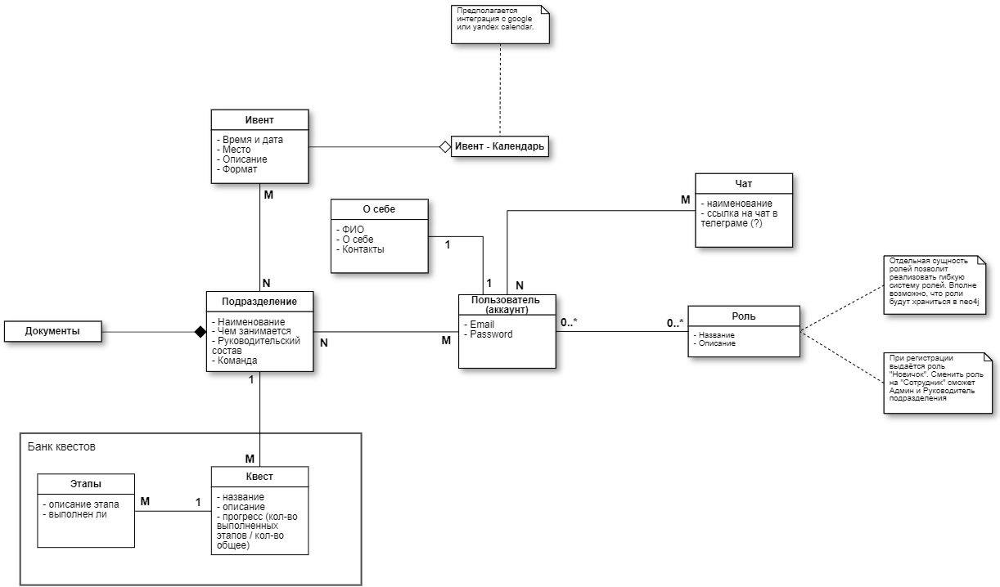

# Backend

Серверная часть на языке Go

## Структура проекта

* **.infra** - инфраструктурные вещи
* **api** - составная часть бекенда
* **adr** - архитектурные решения
* **cmd** - main
* **docs** - общая документация
* **internal** - вся внутрянка бекенда
    * **api** - слой контроллеров
    * **common** - файлы конфигурации
    * **domain** - слой моделей
    * **server** - кастомный HTTP-сервер
    * **telemetry** - логи и метрики
* **service** - сервисы
* **storage** - модуль взаимодействия с БД

## Предметная область


## Документация
- [Архитектурные решения](./adr)
- [Архитектурный стиль](./docs/architecture.md)

Сваггер доступен по пути `http://{host}:{port}}/api/swagger/index.html`

## Сборка проекта

### Инфраструктура
```bash
 # Dockaer
 $ cd ./infra
 $ docker-compose up -d
```

### Бинарник

```bash
 # сборка
 $ go mod tidy
 $ go build -o ./cmd .
 # запуск (на dev-окружении)
 $ . dev.yml ./cmd/config
```

### Swagger

```bash
 $ swag init --output cmd/docs/ --parseInternal \
    -d cmd,internal/domain/base,internal/domain/entity,internal/domain/enum,internal/api
```
